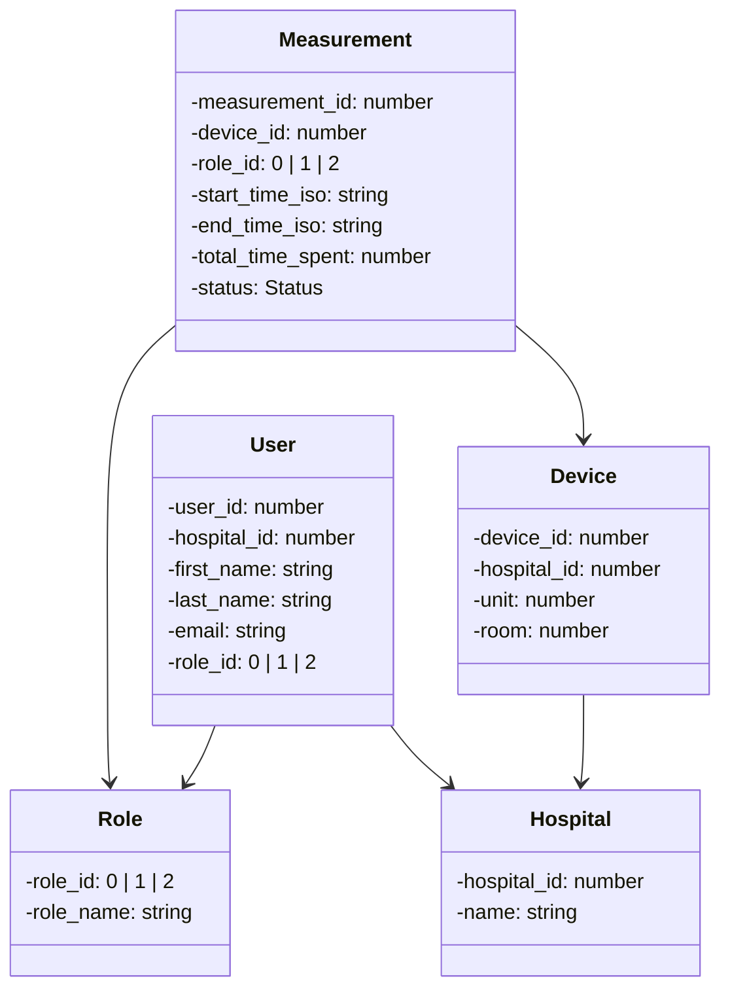

# Maltas Data Dashboard


## Introduction

This document outlines the architecture of a `maltas-data-dashboard` project using a monorepo approach to house both the frontend and backend applications. The frontend is built with Next.js and TypeScript, while the backend is an Express application running on Node.js, connected to a MongoDB database.
## System Dependencies

- Node.js: v16.x or higher

- MongoDB: v4.x or higher

- Lerna: v7.x
 
## Setup and Installation

To set up the monorepo for the first time, follow these steps:

1. Clone the repository.
2. Open the repository folder 
   `cd maltas-data-dashboard`
3. Install depedencies
   `npm install`

## Dev Commands

- Start the frontend development server: `npm run frontend:dev`
- Start the backend server: `npm run backend:dev`
- Run tests: `npm run test`

Lerna will use the `package.json` scripts defined in each package.
## Monorepo Structure

We are using `Lerna` as our monorepo management tool to handle multiple packages in a single repository. This allows us to share code easily between the backend and frontend, reduce duplication, and streamline the development and build process.

The monorepo is organized as follows:

```

/maltas-data-dashboard

|-- packages
    |-- frontend
        |-- .env.local #env variables for frontend
    |-- common # share common types between backend & frontend (not utilized atm)
    |-- backend
        |-- .env #env variables for backend
|-- lerna.json
|-- package.json

```
### Frontend (`/packages/frontend`)

- **Next.js**: The React framework to build the user interface with server-side rendering capabilities for improved performance and SEO.
- **TypeScript**: Used to ensure type safety and enhance developer experience with static typing.
- **React-Query**: Streamlines data-fetching, caching, and state management for asynchronous operations in React apps.
- **next-i18next**: Simplifies the implementation of internationalization by integrating with Next.js's server-side rendering and routing.
- **Nivo**: Delivers a suite of pre-styled chart components based on D3.js, facilitating seamless data visualization integration with comprehensive design controls.
- **Public and Static Files**: Manages non-react assets within the Next.js `/public` directory, automatically accessible at the application's root URL.
- **yup**: Schema builder for form validation, works with Formik to ensure client-side data integrity before API submission.
- **MUI (Material-UI)**: A popular React UI framework offering a comprehensive set of well-designed components that are easy to customize. It follows Google's Material Design guidelines and provides a convenient way to create a cohesive design language across the app.
- **Tailwind CSS**: A utility-first CSS framework that empowers quick in-markup styling with the benefit of smaller, optimized CSS bundle sizes.
- **Formik**: A library that streamlines form state management, validation, and submissions in React apps.
### Backend (`/packages/backend`)

- **Express**: Lean web framework for creating HTTP servers and RESTful APIs with Node.js, offering a robust set of features with a simple and unopinionated approach.
- **Node.js**: The JavaScript runtime that executes code on the server, acting as the backbone of the backend service.
- **MongoDB**: A flexible NoSQL database, ideal for handling JSON-like documents with dynamic schemas, ensuring fast and scalable data persistency.
- **Prisma**: A next-generation ORM providing type-safe database access and migrations, simplifying data modeling and querying with a focus on developer productivity.
- **Javascript**: The scripting language used in tandem with Node.js to build fast and scalable server-side applications.
- **bcrypt**: A library that helps hash passwords securely, an essential aspect for maintaining user data security.
- **emailjs**: A client-side library that enables sending emails directly from the backend without the need for dedicated server-side mail servers.
- **jsonwebtoken (JWT)**: Implements token-based authentication and authorization by generating and verifying JSON web tokens, crucial for secure client-server communication.


## Code Sharing  
**Not utilized at the moment**
Common utility functions, types, constants, and configuration files are placed within a shared directory that both frontend and backend packages can access:

```

|-- packages

    |-- common

        |-- utils

        |-- types

        |-- config

```

## Routing and API Interaction

To keep API interactions clear, the frontend's API calls are defined in a dedicated `api` directory, encapsulating all interactions with the backend. The backend defines its routes using Express's router, with controllers handling business logic.

## Continuous Integration/Continuous Deployment (CI/CD) Pipeline

Our project enables an automated CI/CD pipeline to ensure that every change made to the codebase is tested and deployed systematically. We leverage GitHub Actions for the Continuous Integration (CI) process and DigitalOcean's App Platform for the Continuous Deployment (CD) process.

### Continuous Integration (CI) with GitHub Actions

**GitHub Actions** enables us to automate workflows directly from our GitHub repository. Here is how we use GitHub Actions to build a complete CI workflow:

1. **Trigger**: The CI process is configured to trigger automatically when developers push commits to specific branches (e.g., `main`, `dev`) or when a Pull Request (PR) is created against these branches.

2. **Build**: When the CI process triggers, GitHub Actions run a series of jobs defined in our `.github/workflows` directory. Each job will install dependencies, build, and run tests.

3. **Test**: 
    - For the frontend, the CI runs unit and integration tests using Jest and @testing-library/react.
    - For the backend, the CI runs tests using Jest and Supertest.

4. **Reporting**: After tests and builds, we can configure GitHub Actions to report the status of CI checks back to the GitHub PR, so developers can see if their changes passed all the necessary checks.

`.github/workflows/ci.yml`

```yaml
name: Node.js CI
on:
  push:
    branches: [ "dev" ]
  pull_request:
    branches: [ "dev" ]
jobs:
  build:
   runs-on: ubuntu-latest
    strategy:
      matrix:
        node-version: [18.x]
  steps:
    - uses: actions/checkout@v3
    - name: Use Node.js ${{ matrix.node-version }}
      uses: actions/setup-node@v3
      with:
        node-version: ${{ matrix.node-version }}
        cache: 'npm'
    - run: npm ci
    - run: npm run build --if-present
    - run: npm test
```

This workflow installs the necessary Node.js version, checks out the code, installs dependencies, lints the codebase, runs tests, and executes the build process.

### Continuous Deployment (CD) with DigitalOcean

**DigitalOcean App Platform** provides a simple way to deploy, manage, and scale modern applications. The CD workflow is designed to efficiently deploy the code to DigitalOcean whenever there are changes merged into the `main` branch.

1. **Deployment Trigger**: When changes are merged into `dev` or `master`, a trigger is set to start the deployment process.

2. **Automated Deployment**: DigitalOcean App Platform is connected to the GitHub repository and monitors the `main` branch for changes. When the CD trigger is activated, DigitalOcean automatically pulls the latest changes.

3. **Build and Deploy**: DigitalOcean builds the application based on the supplied configuration (Dockerfile or buildpack) and deploys it to the infrastructure. Environment variables and secrets required by the application are securely provided by the DigitalOcean interface.

4. **Health Checks and Rollback**: After deployment, the platform performs health checks to ensure the application is running correctly. If the checks fail, it can automatically rollback to the previously deployed version.

5. **Monitoring and Alerts**: DigitalOcean App Platform includes monitoring features to track the performance and usage of the deployed applications. Alerts can be set up to notify when certain thresholds are reached or issues are detected.

The CI/CD setup ensures that every push to our repository is comprehensively tested and, if successful, is deployed seamlessly to the production environment with minimum manual intervention. This encourages a culture of frequent, reliable, and incremental updates to the application, which is imperative for a modern agile software development process.
## Testing

Properly tested code is crucial for maintaining the quality and reliability of the application. Here are the testing strategies for both the frontend and backend parts of the monorepo project:

### Frontend Testing (`/packages/frontend`)

- **Jest**: The primary testing framework for executing tests and providing assertions.
- **React Testing Library**: A set of helpers that allow testing React components without relying on their internal details.
- **@testing-library/jest-dom**: A companion library for React Testing Library to provide custom Jest matchers that help test the state of the DOM.
- **ESLint**: used for linting the projects

The structure for the frontend tests is as follows:

```
packages/
  frontend/
    src/
      components/
        __tests__/
          MyComponent.test.tsx
      pages/
        __tests__/
          MyPage.test.tsx
    jest.config.js
```

#### Example `MyComponent.test.tsx`

```tsx
import React from 'react';
import { render, screen } from '@testing-library/react';
import MyComponent from '../MyComponent';

describe('MyComponent', () => {
  it('renders correctly', () => {
    render(<MyComponent />);
    expect(screen.getByText('Hello World')).toBeInTheDocument();
  });
});
```

To run the frontend tests, execute: `npm run frontend test`.

### Backend Testing (`/packages/backend`)

- **Jest**: As with the frontend, Jest is used to run tests and assertions on the backend.
- **Supertest**: A SuperAgent driven library for testing HTTP servers.

The structure for the backend tests is as follows:

```
packages/
  backend/
    src/
      routes/
        __tests__/
          myRoute.test.ts
    jest.config.js
```

#### Example `myRoute.test.ts`

```ts
import request from 'supertest';
import app from '../app';

describe('GET /api/myRoute', () => {
  it('responds with a json message', async () => {
    const res = await request(app)
      .get('/api/myRoute')
      .expect('Content-Type', /json/)
      .expect(200);

    expect(res.body.message).toEqual('Hello from myRoute!');
  });
});
```

To run the backend tests, execute: `npm run backend test`.

---

Both frontend and backend tests can be run automatically as part of the CI/CD pipeline. Test suites should be extended as new features are added to the project, and they should always be kept up-to-date with any changes in the corresponding application code to ensure continued reliability and maintainability of the system as a whole.

## Environment Configuration

Environment variables are managed using `.env` files for different environments (local, development, staging, production). `dotenv` is used in the backend to load environment-specific settings.
## Security

Best practices for security are applied, including:

- Secure HTTP headers with Helmet
- Authentication and authorization with JSON Web Tokens (JWT)
- Encryption with bcrypt for password
## UML Diagram Design
*Not utilized in the current implementation*

